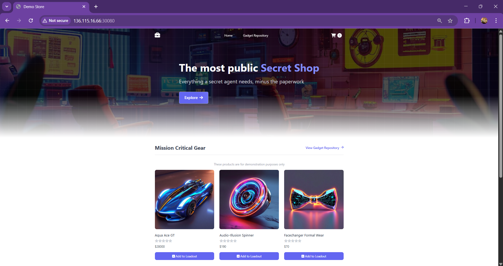
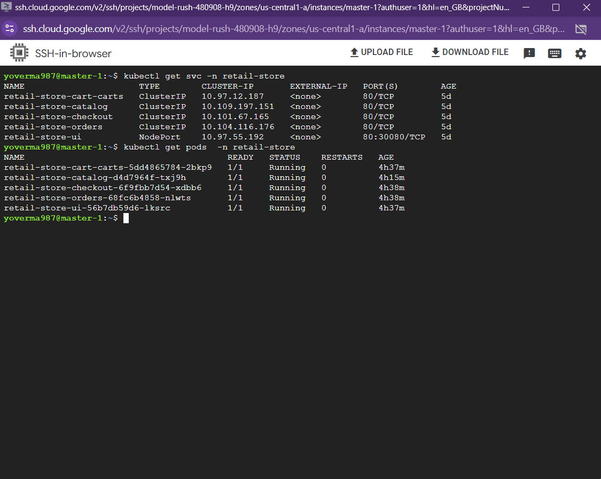
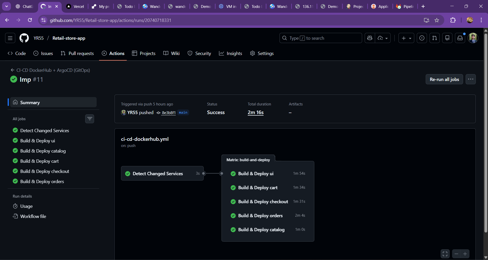
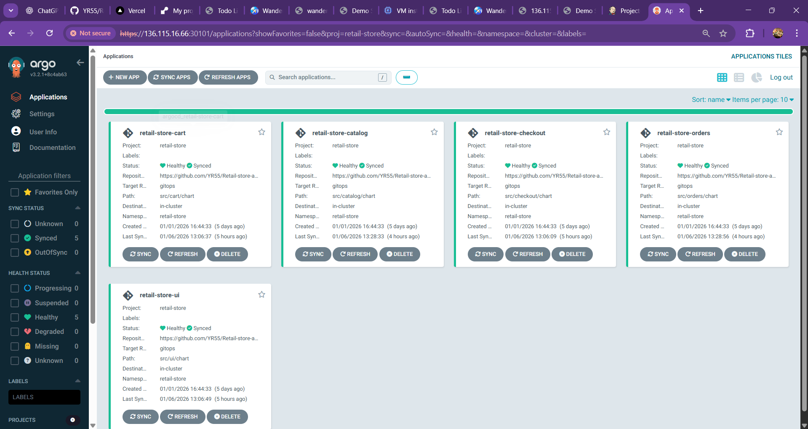
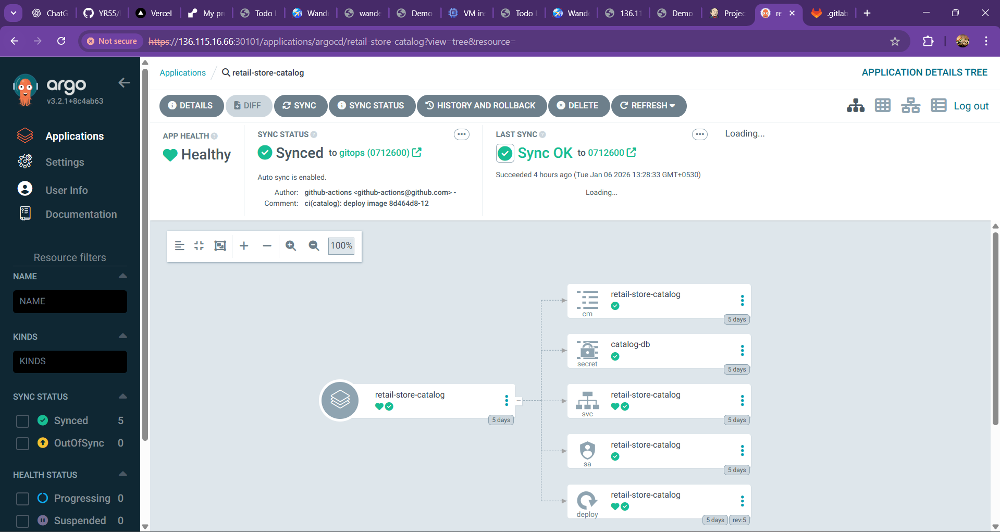
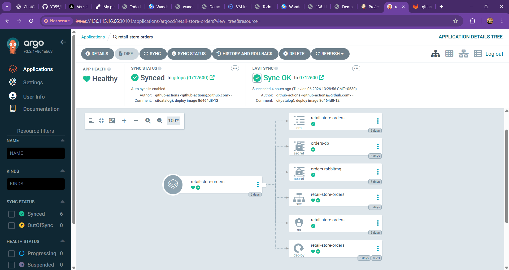
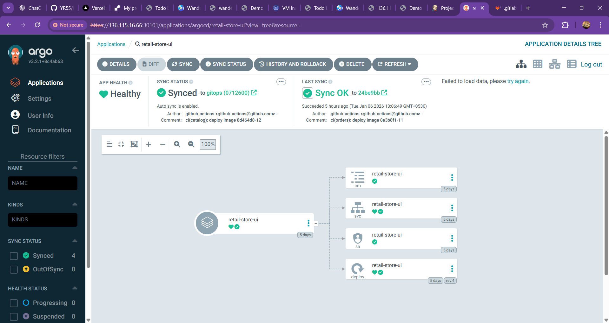
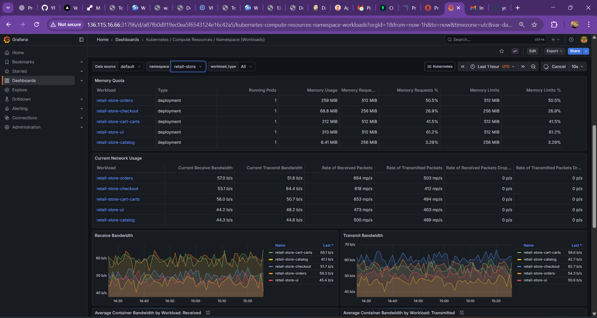

# Retail Store – Multi-Service DevOps Application 🛒🚀

Retail Store is a **multi-service based application** built to understand and implement **real-world DevOps and microservices concepts**.  
The project is designed around **5 independent services**, each containerized and managed separately, following **modern DevOps deployment practices**.


The main goal of this project is not just application development, but to gain **hands-on experience with service isolation, containerization, and DevOps-driven delivery workflows**.

---

## 1️⃣ Application Overview

This application simulates a **retail system** where different functionalities are broken into **independent services** instead of a single monolithic application.

### Key Highlights:
- 5 service-based architecture
- Each service has:
  - Its own source code
  - Its own Dockerfile
  - Independent build and runtime lifecycle
- Services can be developed, deployed, and scaled independently
- Centralized DevOps control for building and running the system

This approach closely reflects how **real enterprise retail applications** are designed.

---

## 2️⃣ Application Architecture

The application follows a **microservices-oriented architecture**.

### Services in the System:
- **UI Service** – User interface layer
- **Catalog Service** – Manages product catalog
- **Cart Service** – Handles shopping cart operations
- **Orders Service** – Manages order lifecycle
- **Checkout Service** – Orchestrates checkout flow

### High-Level Architecture Flow

```
Client / UI
     |
Multiple Independent Services (5)
     |
Containerized Services (Docker)
     |
DevOps Pipeline
     |
Runtime Environment
```

Each service is **loosely coupled**, making the system:
- Easy to maintain
- Easy to deploy
- Easy to explain in interviews


---

## 3️⃣ Tech Stack Used in This Project

### Application Stack (Service-wise)

Each service in this multi-service application uses a technology stack based on its responsibility:

- **UI Service**
  - Java
  - Spring Boot
  - Handles user interface and frontend interactions

- **Catalog Service**
  - Go (Golang)
  - REST API
  - Manages product catalog data

- **Cart Service**
  - Java
  - Spring Boot
  - Manages user shopping cart operations

- **Orders Service**
  - Java
  - Spring Boot
  - Handles order creation and order lifecycle management

- **Checkout Service**
  - Node.js
  - Express.js
  - Orchestrates checkout flow by communicating with other services

Inter-service communication is handled using **REST APIs**, keeping services loosely coupled.

---

### DevOps & Platform Stack

The project is designed and managed using **DevOps and GitOps best practices**:

- Docker (Containerization for all services)
- Multi-stage Docker builds
- Linux-based container runtime
- GitHub Actions (CI pipelines for build and image creation)
- GitHub Actions logging (pipeline execution logs & build visibility)
- Monitoring & logging readiness (container and application-level observability)
- GitOps-based deployment workflow
- Version-controlled deployments
- Cloud-ready deployment architecture

This setup ensures **automation, consistency, and traceability** across the application lifecycle.

---

## 4️⃣ Project Demo & Screenshots

This section contains screenshots from the **actual running system**, covering both **application behavior** and **DevOps workflows**.

---

### 🔹 Application UI


---

### 🔹 Kubernetes Pods (Running Services)


---

### 🔹 GitHub Actions CI Pipeline


---

### 🔹 ArgoCD – Application Overview (Top-Level)


---

### 🔹 ArgoCD – Cart Service


---

### 🔹 ArgoCD – Catalog Service


---

### 🔹 ArgoCD – Orders Service


---

### 🔹 ArgoCD – Checkout Service


---

### 🔹 ArgoCD – UI Service


---

### 🔹 Monitoring & Observability (Prometheus / Grafana)


---

> 📌 *(These screenshots represent the actual running system, not a mock or sample setup.)*

---

## 5️⃣ DevOps Learning Outcome

This project was highly useful for understanding **real DevOps workflows**, including:

- Working with **multi-service applications**
- Writing **clean and explainable Dockerfiles**
- Understanding **service isolation**
- Managing **build vs runtime separation**
- Designing **deployment-friendly architectures**
- Structuring repositories in an **industry-standard way**

Overall, this project helped convert **theoretical DevOps concepts into practical implementation experience**.